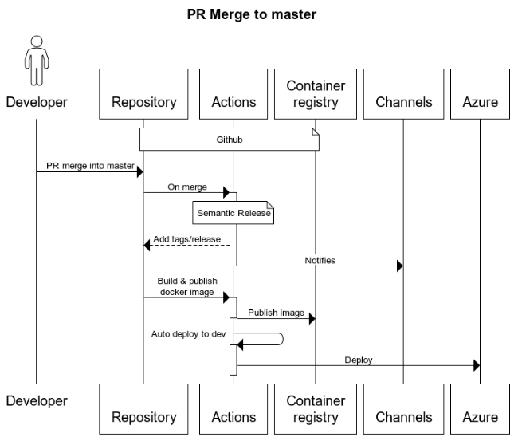

# Release process

This repository uses [Semantic-Release](https://github.com/semantic-release/semantic-release) to perform a release.

The release process is as follows:



With reference to the above sequence diagram:

* a PR is merged into the default branch (currently master)
* the merge triggers an action which runs Semantic-Release
* each commit message is analysed and Semantic-Release determines whether a new release should be generated
* if no release is generated the sequence stops there and no further actions are run
* otherwise, Semantic-Release:
    * generates the appropriate version number
    * tags the code
    * generates the change log
    * generates a release within github and attaches the change log
    * it then notifies any channels (currently only email notifications will be sent)
* the generation of a release then triggers the 'docker-build' action which:
    * builds a container with the app
    * publishes it to the github container registry with the following tags:
        * the version number generated by Semantic-Release, e.g. 'v2.3.1'
        * 'latest'
* successful completion of the docker-build action triggers the 'auto-deploy' action, which picks up the latest version of the image i.e. ghcr.io/dfe-digital/childrens-social-care-cpd:latest which is then deployed into Azure

## Version number generation

The version number is determined by Semantic Release when it examines the commit messages of the PR.

We use the default preset which is the [Angular message format](https://github.com/angular/angular/blob/main/CONTRIBUTING.md#-commit-message-format).

* adding ```BREAKING CHANGE``` in the commit description will cause a **MAJOR** version increase
* ```feat:``` will cause a *MINOR* version bump
* ```fix:``` will cause a *PATCH* version bump

### Guide lines

In day to day work, it is not necessary to use the angular format for commit messages, especially when checking in work-in-progress. Commits **should** use the Angular styling when they are designed to signify the resolution of a piece of work.

In general this can be accomplished by using the format when merging a PR on Github. This has the added advantage of referencing the PR number in the release notes.

However they should be used by developers if they are performing a specific task during a PR. For example adding new documentation or tests.

Or you may come across a minor bug whilst developing a feature and wish to fix it there and then. In this case the bug fix should be committed using the ```fix``` prefix, for example:
```
fix: wrong CSS applied to the container
```

When the PR is subsequently merged with it's own ```feat``` commit message, Semantic Release will take both of these commits into account when generating the changelog.